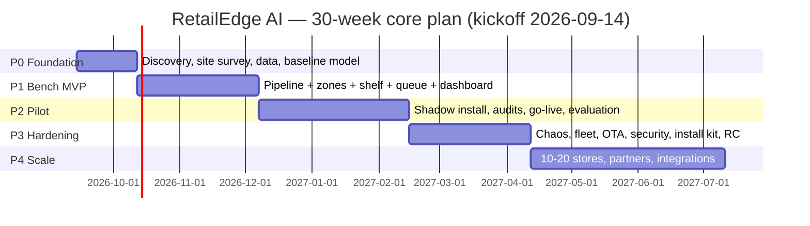

# RetailEdge AI — Detailed Implementation Plan

**Full phased execution plan for Problem Statement ID 26179** — this is the detailed re-baseline of the outline solution, expanded into week-by-week workstreams with owners, deliverables, exit gates, budgets, and risk controls.

---

## 0. Roadmap at a Glance

| Phase | Weeks | Name | Goal | Hard Exit Gate |
|---|---|---|---|---|
| **P0** | 1–4 | Discovery & Foundation | Requirements frozen, pilot site ready, baseline models working | Baseline person-detector mAP@50 ≥ 0.85 on real store footage |
| **P1** | 5–12 | Bench MVP | All 3 analytics modules working on edge hardware in lab | 3 streams × 15 FPS sustained 24 h; entry/exit MAE ≤ 5% |
| **P2** | 13–22 | Pilot Deployment | 3–5 live stores, shadow → live alerts, staff trained | Count MAE ≤ 2%, OOS P/R ≥ 0.90/0.85, uptime ≥ 98% |
| **P3** | 23–30 | Hardening & Release 1.0 | Fault-proof, secure, fleet-managed, installable by technicians | 72 h soak test clean; all chaos faults recover < 5 min; OTA 100% |
| **P4** | 31+ | Scale & Commercialize | 10–20 stores, partner channel, chain BI | Unit economics proven; NPS ≥ 40 from store managers |

---

## 1. Team, Cadence & Governance

### 1.1 Core Team (7–9 people)

| Role | Count | Responsibility | Active Phases |
|---|---|---|---|
| Product / Field Lead | 1 | Requirements, store partnerships, pilot ops, ROI story | All |
| CV/ML Lead | 1 | Model architecture, training strategy, accuracy sign-off | All |
| ML Engineer | 1 | Training, annotation ops, quantization, model registry | P0–P3 |
| Edge Engineer | 1 | DeepStream/GStreamer pipelines, Jetson/Hailo deployment, watchdogs | P1–P3 |
| Backend Engineer | 1 | Event bus, DB, APIs, POS/ERP integration, fleet agent | P1–P4 |
| Frontend Engineer | 1 | Dashboard, staff app, planogram tool | P1–P4 |
| QA / Field Ops | 1 | Test protocols, ground-truth audits, chaos testing, installs | P2–P4 |
| Data Annotators | 2 (part-time) | Bounding boxes, SKU labels, audit support | P0–P2 |

### 1.2 Governance Cadence

- **Daily:** 15-min standup per workstream.
- **Weekly:** Cross-team demo (working software only) + metrics review.
- **Phase gates:** Formal review at end of each phase — exit criteria checked against evidence (test logs, audit reports). **A phase does not close on opinion; it closes on data.**
- **Tooling:** GitHub + Actions (CI), Weights & Biases or MLflow (model registry), CVAT/Label Studio (annotation), Docker Compose (packaging), Prometheus + Grafana (device health, local).

---

## 2. Phase 0 — Discovery & Foundation (Weeks 1–4)

**Objective:** Convert the problem statement into frozen requirements, secure a pilot store, and prove detection works on *real* Indian store footage before building anything.

### Week-by-Week

| Week | Workstream | Key Tasks | Output |
|---|---|---|---|
| **1** | Product | Interviews with 3 store archetypes (kirana, supermarket, pharmacy); define KPIs and alert thresholds with store owners; privacy stance + signage draft | `PRD.md` v1, signed pilot-store LOI |
| **1** | Compliance | Draft DPDP-aligned data policy: no faces stored, metadata-only sync, retention clocks | `PRIVACY.md` v1 |
| **2** | Field Ops | Site survey at pilot store: lighting (day/night), power, mounting points, blind spots, Wi-Fi/LAN, camera field-of-view sketches | Site survey report + camera placement diagram |
| **2** | Procurement | PO edge hardware (1× Jetson Orin Nano bench kit + 4 PoE cameras), SSDs, mounts | Hardware in hand by end of W3 |
| **3** | Data | **Collection Sprint #1:** 8–10 h footage across morning-peak/afternoon/evening-peak/low-light at pilot store; 3 camera angles minimum | Raw dataset (~150 GB temp, purged after annotation) |
| **3** | Annotation | Annotation guideline v1 (person bbox; occlusion rules; minimum box size); CVAT project setup; model-assisted pre-labeling | Annotated frames begin flowing |
| **4** | ML | Fine-tune YOLO11n on dataset v0 (~5k frames); export ONNX; measure mAP on held-out store footage | Baseline detector + accuracy report |
| **4** | Eng | Repo structure, CI skeleton (lint, test, model-eval job), Docker base images, device bring-up (Jetson + TensorRT INT8 conversion works) | Green CI, `benchmark.md` |

### Key Quantities for Phase 0

Annotation throughput with model-assisted pre-labeling (~50 s/frame for person boxes):

$$10{,}000 \text{ frames} \times 50 \text{ s} \approx 139 \text{ person-hours} \Rightarrow 2 \text{ annotators} \times 2 \text{ weeks}$$

### Deliverables & Exit Gate

- `PRD.md`, `PRIVACY.md`, site survey, dataset v0, baseline model, bench hardware running.
- **Gate:** baseline mAP@50 ≥ 0.85 on pilot footage; if below → extend dataset before any pipeline work (this is the cheapest possible failure point to discover).
- **Phase risks:** store owner withdraws (mitigate: 2 backup sites), low-light footage unusable (mitigate: mandate IR-capable cameras in placement plan).

---

## 3. Phase 1 — Bench MVP (Weeks 5–12)

**Objective:** All three analytics modules (shopper, shelf, queue) running end-to-end on the edge box in the lab, with dashboard v1 — using *recorded pilot-store footage* for repeatability.

### Week-by-Week

| Week | Module | Key Tasks | Output |
|---|---|---|---|
| **5–6** | Ingest + Detect + Track | DeepStream pipeline: 3 RTSP streams → decode → YOLO INT8 → ByteTrack; FPS/latency instrumentation; RTSP auto-reconnect | `pipeline/` service, 3×15 FPS stable |
| **7** | Zones + Counting | `store_config.yaml` schema (cameras, zones, lines, thresholds); line-crossing entry/exit counter; live occupancy | Config-driven zone engine |
| **8** | Dwell + Heatmap | Zone dwell tracker with track-fragmentation filtering; heatmap accumulator + hourly PNG generation; event emission to local Mosquitto + SQLite | Event schema v1, `events` table |
| **9** | Shelf — Data | Shelf-camera capture at pilot store; SKU image capture via staff phone app (50–100/SKU); 2-stage model (generic product detector + per-store classifier) v1 | Product detector + classifier v1 |
| **10** | Shelf — Logic | Planogram web tool (draw slots on a shelf frame → auto-generates config); occupancy computation; 30-frame debounce; gap-detection fallback heuristic | `LOW_STOCK`/`OOS` alerts with snapshots |
| **11** | Queue | Head-count per lane polygon; EMA smoothing; M/M/c wait predictor; service-time measurement from track enter→bill events (when POS clock available) | `queue_predictor.py` integrated |
| **12** | Dashboard | Dashboard v1: live occupancy, heatmap view, alert feed, queue strip; daily PDF report generator; replay harness (feed recorded footage through full pipeline on demand) | **Internal Demo Day** |

### Reference Config (the contract between modules)

```yaml
# store_config.yaml — versioned per store; drives all modules
store_id: "IN-BLR-014"
cameras:
  - { id: entrance_1, rtsp: "rtsp://192.168.1.10/ch1", role: entrance }
  - { id: shelf_a3,   rtsp: "rtsp://192.168.1.14/ch1", role: shelf }
  - { id: checkout,   rtsp: "rtsp://192.168.1.17/ch1", role: queue }
lines:
  - id: entry_line, a: [100, 400], b: [900, 400], in_direction: down
zones:
  - id: promo_endcap_A
    polygon: [[210, 300], [520, 300], [520, 640], [210, 640]]
    dwell_alert_sec: 45
planogram:
  shelf_a3:
    slots:
      - { sku: "SKU-88213", bbox: [40, 120, 180, 260] }
      - { sku: "SKU-90441", bbox: [190, 120, 330, 260] }
thresholds:
  out_of_stock_frames: 30
  queue_wait_min: 5.0
  occupancy_warn: 80
```

### Bandwidth/Storage Feasibility Check (justify the edge design with numbers)

Cloud-video approach for 6 streams × 14 h/day at 1.5 Mbps:

$$6 \times 1.5 \text{ Mbps} \times 50{,}400 \text{ s} \div 8 \approx 57 \text{ GB/day}$$

RetailEdge event-only sync: ~30k events/day × 300 B ≈ **9 MB/day** — a ~6,000× reduction. Snapshot retention: 100/day × 60 KB × 90 days ≈ 540 MB — fits a 64 GB SSD alongside OS + models with huge headroom.

### Deliverables & Exit Gate

- Working bench system, dashboard v1, replay harness, model registry v1.
- **Gate:** 24 h bench soak (3 streams) with zero restarts; entry/exit count MAE ≤ 5% vs. manual tally on 3 recorded hours; all alert types fire correctly on scripted footage.
- **Phase risks:** ByteTrack ID-switches in crowds (mitigate: tune `track_buffer`, zone-entry hysteresis), Jetson thermal throttling (mitigate: fan + power-mode profile).

---

## 4. Phase 2 — Pilot Deployment (Weeks 13–22)

**Objective:** Deploy to 3–5 real stores. Run in **shadow mode first** (alerts logged, not delivered), validate against ground truth, then progressively go live per module.

### The Shadow → Live Progression (per store)

```
W13-14: Install + calibrate        → SHADOW (log everything, alert nobody)
W15-16: Ground-truth audits        → tune per store (thresholds, zones, lighting)
W17-18: Staff app + training       → LIVE: entry/exit + queue alerts
W19:    Replenishment workflow     → LIVE: shelf alerts + SLA loop
W20-22: Measure, iterate, review  → full live, weekly reports to owner
```

### Week-by-Week

| Week | Workstream | Key Tasks | Output |
|---|---|---|---|
| **13–14** | Field Ops | Install kit at 3 stores (mount, cable, edge box, LAN); on-site calibration: draw zones/lines with manager; verify night performance; enroll store in shadow mode | 3 stores streaming, `calibration_log.md` |
| **15–16** | QA | **Ground-truth protocol:** 3× 1-h manual entry/exit tallies per store; 2× daily queue head-counts; shelf audits vs. alerts. Feed discrepancies back into per-store tuning | Accuracy audit report #1 |
| **17** | Mobile | Staff app v1: receive alerts (photo + zone), acknowledge, mark done, photo-confirm restock; staff training session (45 min, printed one-pager) | Staff app live at store A |
| **18** | Integration | POS integration (CSV drop or REST): hourly transaction counts → conversion proxy, service-time calibration of $\mu$ in queue model; **go live** entry/exit + queue alerts at store A | POS pipeline, first live alerts |
| **19** | Ops | **Go live** shelf alerts; define replenishment SLA (acknowledge ≤ 5 min, fix ≤ 15 min); measure MTTA/MTTR | SLA dashboard metric |
| **20** | Product | Weekly auto-report (PDF: footfall, heatmap, queue stats, OOS events, SLA %); store-manager review meeting at each pilot | Report pipeline |
| **21** | Fix Sprint | Triage all pilot feedback: accuracy fixes, UX friction, false-positive tuning (biggest source: reflections, mannequins, strollers) | Fix list closed ≥ 80% |
| **22** | Review | Compile pilot evaluation vs. targets; pricing/ROI model from real data; **go/no-go for Phase 3** | Pilot report + decision |

### Ground-Truth Audit Math (how much manual verification is enough)

For count accuracy at ±2% confidence, per store per day-part, compare $n$ audited hours where the required sample for estimating count error rate within margin $e$:

$$n \geq \frac{z^2 \, p(1-p)}{e^2} \approx \frac{(1.96)^2 (0.5)(0.5)}{(0.02)^2} \approx 2{,}401 \text{ crossings}$$

In practice this is reached in ~3–4 audited peak hours per store — hence the W15–16 schedule.

### Deliverables & Exit Gate

- 3–5 live stores, staff app, POS integration, audit reports, pilot evaluation.
- **Gate:** count MAE ≤ 2%, OOS precision ≥ 0.90 / recall ≥ 0.85, queue MAE ≤ 1 head, alert MTTA ≤ 5 min, system uptime ≥ 98% across pilot, ≥ 1 store owner willing to be a **reference customer**.
- **Phase risks:** staff ignore alerts (mitigate: super-simple app + SLA gamification), false-positive fatigue (mitigate: per-store threshold tuning week), camera vandalism/misalignment (mitigate: auto-blur detection alert when FOV shifts).

---

## 5. Phase 3 — Hardening & Release 1.0 (Weeks 23–30)

**Objective:** Turn a pilot system into a product a technician can install without engineers present, that survives Indian power/network reality, and can be managed remotely across a fleet.

### Week-by-Week

| Week | Workstream | Key Tasks | Output |
|---|---|---|---|
| **23** | Reliability | Failure-mode audit: power cut, camera dropout, disk full, thermal throttle, SD/SSD wear, clock drift. Watchdogs (`systemd` + hardware watchdog), auto-recovery, health telemetry (Prometheus node exporter) | `FMEA.md`, recovery automation |
| **24** | Offline Resilience | **48-h WAN-kill chaos test** at a pilot store: full feature operation, store-and-forward sync on reconnect, bandwidth measurement of backlog upload | Chaos test report |
| **25** | Fleet | Fleet agent + central console v1: heartbeats, model/config versions, per-store KPI rollups, multi-tenant view for chains | Fleet console |
| **26** | OTA | Signed model/config bundles; staged rollout (canary store → 10% → all); atomic apply + automatic rollback on health-check failure | `ota-service` v1 |
| **27** | Security | TLS on all endpoints, per-device certs, disk encryption, secrets vault, LAN isolation guide; internal pen-test + fix cycle | Security checklist signed off |
| **28** | Deployment | **Zero-touch provisioning:** flash image → boot → box auto-registers, pulls `store_config.yaml`, self-tests cameras; install runbook + camera calibration wizard in dashboard | Install kit (target: < 4 h/store, 1 technician) |
| **29** | Performance | Quantization pass (INT8 vs FP16 mAP delta < 1%); thermal test at 40 °C ambient; cost-down BOM validated (RPi5+Hailo tier passes feature gate) | Perf report, final BOM |
| **30** | Release | RC freeze; full docs (admin, installer, user); support playbook; 1-week RC field trial in 2 stores | **Release 1.0** |

### Chaos Test Matrix (Week 24)

| Fault Injected | Expected Behavior | Max Recovery Time |
|---|---|---|
| WAN disconnected 48 h | Full local function; events queued | 0 (by design) |
| WAN restored | Backlog sync, no duplicates (idempotent event IDs) | < 10 min |
| Power cut 10 min | Clean boot, pipeline auto-resumes | < 3 min |
| Camera unplugged | Alert to dashboard, other cameras unaffected | detection < 60 s |
| Disk ≥ 90% | Retention pruner activates, oldest snapshots purged | automatic |
| Process crash | `systemd` restart + watchdog event | < 30 s |

### Deliverables & Exit Gate

- Release 1.0 image, fleet console, OTA pipeline, install kit, docs, support playbook.
- **Gate:** 72 h soak with zero manual intervention; every chaos fault recovered within limits; OTA 100% success across test fleet; security criticals = 0; fresh technician installs a store in < 4 h using only the runbook.
- **Phase risks:** OTA bricks a device (mitigate: A/B partition + watchdog auto-revert), thermal failures in summer (mitigate: derated power profile + industrial enclosure option).

---

## 6. Phase 4 — Scale & Commercialization (Weeks 31+)

**Objective:** Prove repeatability and unit economics; open the chain/enterprise channel.

### Week-by-Week (rolling)

| Weeks | Workstream | Key Tasks |
|---|---|---|
| **31–34** | Rollout | 10–20 store deployment via install kit; support tiering (L1 remote, L2 field, L3 engineering); weekly fleet health reviews |
| **31–34** | Product | Self-serve planogram tool (manager draws slots, no engineer visit); API v1 for ERP partners |
| **35–40** | Integrations | ERP/IMS connectors: Tally, Zoho Inventory, SAP via webhook/CSV adapters; WhatsApp alert delivery (when online) as opt-in |
| **35–40** | Business | Pricing tiers (Starter ₹/store/mo, Pro, Chain); reference-customer case study with measured ROI (stock-out reduction %, avg-wait reduction %) |
| **41+** | Expansion | Tier-2/3 city pilots via distributor/partner channel; franchise multi-site dashboard; ML improvements: demand-aware replenishment suggestions, footfall-based staff scheduling |

---

## 7. Cross-Phase Workstream A — Data & Model Ops

### Dataset Targets

| Dataset | Size | Timing | Refresh |
|---|---|---|---|
| Person detection | 10k frames (multi-store, multi-light) | P0–P1 | +2k hard examples per quarter |
| SKU classifier | 50–100 images/SKU (staff phone app) | P1 | On every new planogram |
| Queue/heads | 3k frames | P1–P2 | Per-store calibration |
| Low-light/occlusion hard set | 2k frames | P2 | Continuous from pilot audits |

### Model Promotion Pipeline (CI for models)

```
new data / trigger → annotate → train (cloud GPU) → eval vs. champion
   → INT8 quantize → bench (FPS + mAP on target HW) → sign
   → OTA canary (1 store, 48 h) → staged rollout → promote champion
```

**Automatic retraining triggers:** accuracy audit drop > 3% vs. baseline; new store archetype added; seasonal lighting shift (e.g., Diwali crowd patterns); false-positive cluster detected by staff "dislike" feedback in the app.

---

## 8. Cross-Phase Workstream B — QA & Testing Pyramid

| Layer | What | Tooling | Cadence |
|---|---|---|---|
| Unit | Zone math, debouncers, predictors, config parser | `pytest` | Every commit |
| Integration | Recorded-footage replay through full pipeline → expected events | Replay harness (built W12) | Nightly |
| Hardware-in-loop | Same replay on Jetson/RPi: FPS, latency, thermals | Bench rig | Weekly + pre-release |
| Field | Manual ground-truth audits vs. system output | Audit app/sheets | Weekly in P2, monthly after |
| Chaos | WAN-kill, power-cut, camera-pull, disk-full | Scripted fault injector | P3 gate + each major release |

---

## 9. Cross-Phase Workstream C — Privacy & DPDP Compliance Checklist

| Item | P0 | P2 | P3 | Ongoing |
|---|---|---|---|---|
| Entry signage + owner agreement | ✅ | verify per store | ✅ | annual review |
| No face detection/recognition in codebase (CI check on model classes) | ✅ | ✅ | ✅ | ✅ |
| Ephemeral track IDs (daily re-randomization) | ✅ | ✅ | ✅ | ✅ |
| Snapshot blur/mosaic + 24 h purge verified | — | ✅ | automated test | ✅ |
| Metadata-only sync audit (payload scanner in CI) | — | ✅ | ✅ | ✅ |
| Kill-switch (pause all zones) tested | — | ✅ | ✅ | ✅ |
| Retention clocks (events 180 d, snapshots 24 h) enforced in DB | — | ✅ | ✅ | ✅ |

---

## 10. Budget Summary (Indicative, INR)

<details>
<summary><b>Expand for line-item budget — pilot program through Release 1.0</b></summary>

| Item | Detail | Estimate |
|---|---|---|
| Edge hardware | 3 pilot stores × ₹40k (Orin Nano + NVMe + enclosure) | ₹1,20,000 |
| Cameras | 12 PoE IP cams × ₹8k | ₹96,000 |
| Dev bench | 1 Jetson + 2 cams + accessories | ₹60,000 |
| Budget-tier validation | 1× RPi5 + Hailo-8L kit | ₹25,000 |
| GPU training | Cloud spot (~20 runs) or institutional GPU | ₹50,000 |
| Annotation | ~10k frames + SKU sets + audits | ₹70,000 |
| Cloud (dev/staging/fleet) | 8 months | ₹25,000 |
| Field travel & installs | 3 stores × multiple visits | ₹40,000 |
| Enclosure, cabling, mounts, signage | Consumables | ₹30,000 |
| Contingency (15%) | — | ₹77,000 |
| **Total (P0–P3)** | | **≈ ₹5,90,000** |

Per-store marginal hardware at scale (target): **₹18k–₹45k** depending on tier, excluding cameras the store may already own.
</details>

---

## 11. Master Risk Register

| # | Risk | Phase | L×I | Mitigation |
|---|---|---|---|---|
| 1 | Detector accuracy collapses in low light/crowds | P0–P1 | H×H | IR cameras mandatory; hard-example mining loop; per-store threshold tuning |
| 2 | Track ID-switches corrupt dwell/count metrics | P1 | M×H | Hysteresis on zone entry/exit; debounced events; audit-based tuning |
| 3 | False-positive alert fatigue → staff ignore app | P2 | M×H | Shadow-mode tuning before go-live; precision gate ≥ 0.90 before enabling alerts |
| 4 | Store owner privacy objections | P0–P2 | M×H | No-face architecture, signage, kill-switch, owner-visible retention settings |
| 5 | OTA bricks fleet devices | P3 | L×H | A/B partitions + watchdog auto-revert; canary rollout only |
| 6 | Thermal failure in Indian summers | P3 | M×M | 40 °C chamber test; derated power profiles; vented industrial enclosures |
| 7 | Planogram churn makes shelf config stale | P2–P4 | M×M | Self-serve planogram editor; drift detection (unknown-slot alerts) |
| 8 | Pilot store churn / ownership change | P2 | M×M | 2 backup sites in P0; short contracts with clear exit |
| 9 | Edge hardware supply delays | P0–P1 | M×M | Dual-vendor design (Jetson **or** RPi+Hailo); order in W2 |
| 10 | Unit economics fail at small-store tier | P4 | M×H | Budget tier (RPi5+Hailo) validated in P3; shared-hardware mode (analytics box doubles as store's NVR/POS back-end) |

---

## 12. Phase-wise KPI Targets (what the gate review inspects)

| KPI | P1 Exit | P2 Exit | P3 Exit | P4 Target |
|---|---|---|---|---|
| Streams sustained | 3 × 15 FPS | 4–6 | 6–8 | 8+ |
| Entry/exit count MAE | ≤ 5% | ≤ 2% | ≤ 2% | ≤ 2% |
| OOS precision / recall | fires correctly | ≥ 0.90 / 0.85 | ≥ 0.92 / 0.88 | ≥ 0.92 / 0.88 |
| Queue-length MAE | ≤ 2 heads | ≤ 1 head | ≤ 1 head | ≤ 1 head |
| Alert MTTA (staff ack) | — | ≤ 5 min | ≤ 5 min | ≤ 3 min |
| Uptime | 24 h bench | ≥ 98% | ≥ 99.5% | ≥ 99.5% |
| Install time/store | — | 2 days (eng-assisted) | < 4 h (tech-only) | < 3 h |
| Measured customer ROI | — | baseline captured | case study draft | stock-outs ↓ ≥ 30%, avg wait ↓ ≥ 25% |

---

## 13. Consolidated Timeline

<details>
<summary><b>Gantt view (Mermaid) — expand</b></summary>


</details>

---

## Immediate Next Actions (Week 1 Checklist)

- [ ] Sign pilot-store LOI + 2 backup sites
- [ ] `PRD.md` v1 and `PRIVACY.md` v1 drafted and reviewed
- [ ] Hardware PO placed (W2 delivery)
- [ ] CVAT project + annotation guideline v1 live
- [ ] CI skeleton with model-eval job green

---

Want me to generate any of the operational artifacts next — e.g., the **Week 1 sprint backlog in issue format**, the **site survey checklist template**, the **ground-truth audit sheet**, or a **pitch-deck storyline** built around this plan for the hackathon presentation?